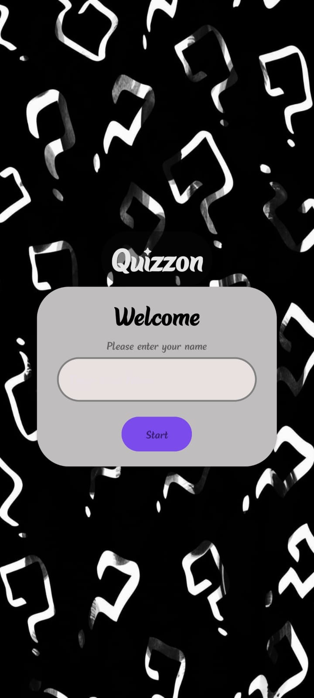
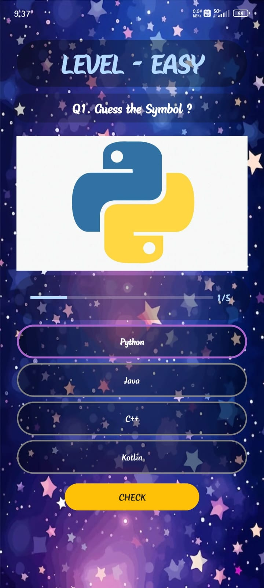

<!DOCTYPE html>
<html>
<head>
  <title>1.Quizzon - Quiz App</title>
</head>
<body>

<h1>📚 Quizzon – Quiz App</h1>

Quizzon is a fun and interactive quiz app built to test knowledge through exciting questions and a clean UI. Enjoy smooth navigation, instant scoring, and a great quiz experience!

<h2>📱 Screenshots</h2>

  
  

<h2>📥 Download APK</h2>

Click below to download the app:

<a href="https://drive.google.com/file/d/1d9wB4rhw_-Y09hpJMzkUh5klDD2g-2qD/view?usp=drivesdk" download>
  <strong>👉 Download Quizzon APK</strong>
</a>

<h2>✨ Features</h2>
<ul>
  <li>Multiple quiz categories</li>
  <li>Real-time score results</li>
  <li>Clean and modern UI</li>
  <li>Fast & smooth performance</li>
  <li>Beginner-friendly navigation</li>
</ul>

<h2>🛠 Tech Stack</h2>
<ul>
  <li><strong>Language:</strong> Kotlin</li>
  <li><strong>UI:</strong> XML</li>
  <li><strong>IDE:</strong> Android Studio</li>
</ul>

<h2>📂 Installation (Developer Build)</h2>
<pre>
git clone https://github.com/SANSKAR-D/App-dev-projects/edit/main/prototype-projects/QuizzonQuizApp
# Open in Android Studio
# Sync Gradle & Run ▶️
</pre>

<h2>🤝 Contributing</h2>

Contributions are welcome! Open an issue to suggest features or improvements.

<h2>📧 Contact</h2>

Email: sethsanskar856@gmail.com

</body>
</html>

